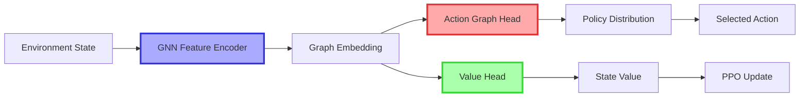
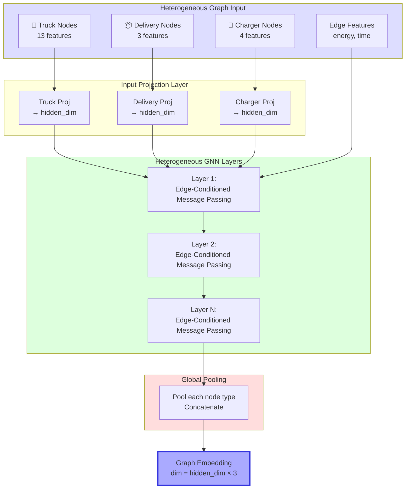
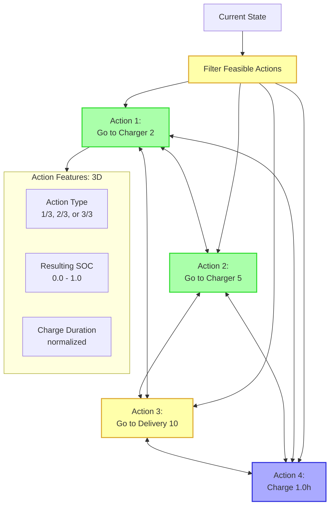
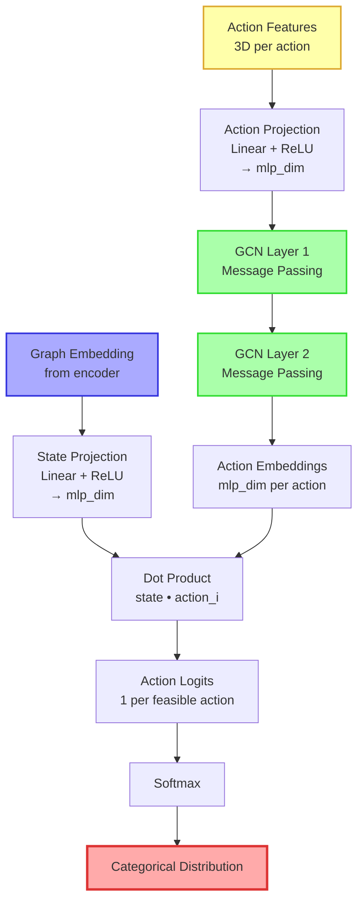
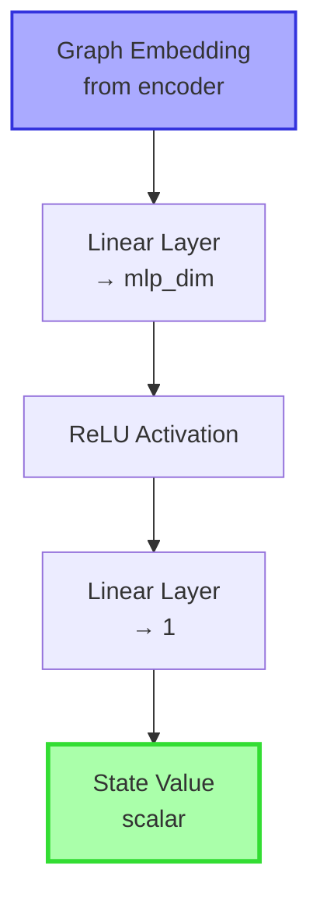
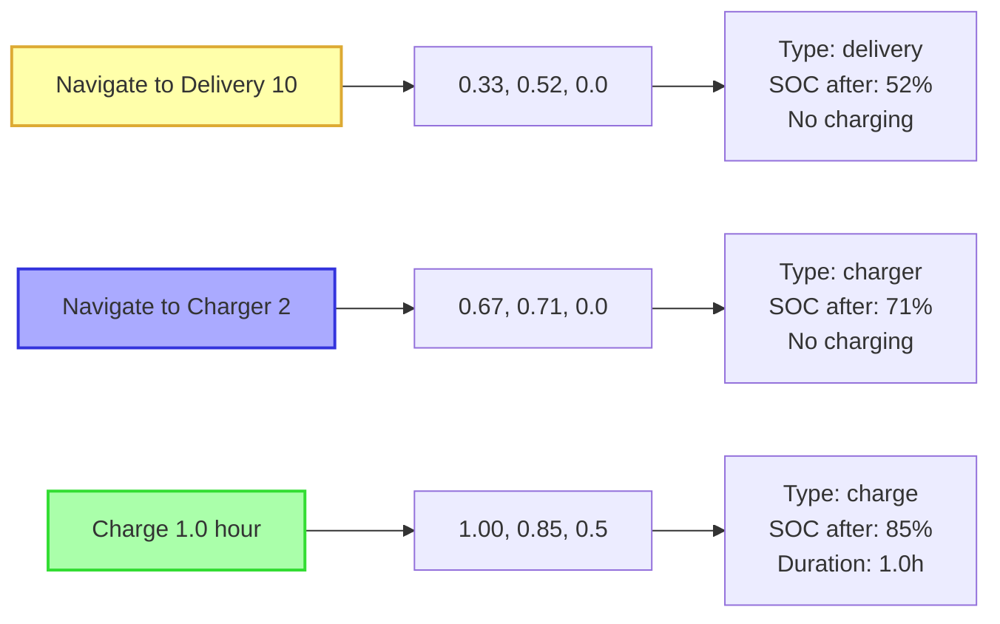
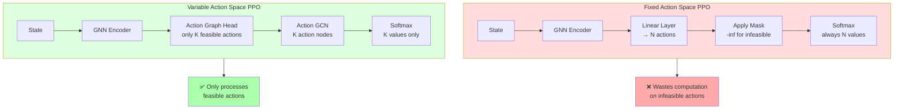

# PPO Variable Action GNN Architecture

**Proximal Policy Optimization with Variable-Sized Discrete Action Spaces**

---

## Overview

PPO Variable Action GNN is a reinforcement learning architecture that handles **variable-sized action spaces** at each timestep by using a **Graph Convolutional Network (GCN) over feasible actions**. This enables the agent to reason over different numbers of valid actions as the environment state changes.



---

## Architecture Components

### 1. GNN Feature Encoder (Shared Backbone)



**Key Features:**
- **Heterogeneous:** Separate projections for each node type
- **Edge-Conditioned:** Messages depend on edge features (energy, time)
- **Multi-Layer:** Typically 3 layers for information propagation
- **Global Pooling:** Aggregates all node types into single embedding

---

## 2. Action Graph Head (Actor)

### Action Graph Construction

For each timestep, we build a **fully connected graph over feasible actions**:



### Action Graph Head Architecture



**Action Graph Head Process:**

1. **Project State:** `state_repr = ReLU(Linear(graph_embedding))`
2. **Project Actions:** `action_features = ReLU(Linear(action_feats))`
3. **GCN Layers:** Message passing between feasible actions
4. **Compute Logits:** `logit_i = dot(state_repr, action_embedding_i)`
5. **Sample:** Categorical distribution over feasible actions

---

## 3. Value Head (Critic)



**Value Head:** Simple 2-layer MLP that estimates the state value `V(s)`

---

## Complete Forward Pass

```mermaid
graph TB
    subgraph Input[Input]
        State[HeteroData State]
        ActionMask[Feasible Action Mask]
    end
    
    subgraph Encoder[GNN Feature Encoder]
        Project[Project Node Features<br/>to hidden_dim]
        GNN[3× Hetero GNN Layers<br/>Edge-Conditioned MP]
        Pool[Global Mean Pooling<br/>per node type]
        Concat[Concatenate<br/>Truck + Delivery + Charger]
    end
    
    subgraph ActionHead[Action Graph Head]
        Filter[Filter Feasible Actions<br/>using mask]
        BuildGraph[Build Fully Connected<br/>Action Graph]
        ActionGCN[2× GCN Layers<br/>on action graph]
        Score[Dot Product Scoring<br/>state • action]
    end
    
    subgraph ValueHead[Value Head]
        ValueMLP[2-Layer MLP]
    end
    
    subgraph Output[Output]
        Logits[Action Logits<br/>variable size]
        Value[State Value V(s)]
        Policy[Categorical Policy<br/>π(a|s)]
    end
    
    State --> Project
    Project --> GNN
    GNN --> Pool
    Pool --> Concat
    
    Concat --> ActionGCN
    Concat --> ValueMLP
    
    ActionMask --> Filter
    Filter --> BuildGraph
    BuildGraph --> ActionGCN
    
    ActionGCN --> Score
    Score --> Logits
    Logits --> Policy
    
    ValueMLP --> Value
    
    style Encoder fill:#ddf
    style ActionHead fill:#fdd
    style ValueHead fill:#dfd
    style Policy fill:#faa,stroke:#d33,stroke-width:3px
    style Value fill:#afa,stroke:#3d3,stroke-width:3px
```

---

## Action Features (3 Dimensions)

Each feasible action is represented by a 3D feature vector:

| Feature | Description | Value Range | Example |
|---------|-------------|-------------|---------|
| **action_type** | Type of action | • `1/3` = Navigate to delivery<br/>• `2/3` = Navigate to charger<br/>• `3/3` = Charge at current location | `0.33` for delivery |
| **resulting_soc** | Battery % after action | `0.0 - 1.0` (normalized) | `0.65` = 65% battery |
| **charge_duration** | Charging time (if applicable) | `0.0 - 1.0` (normalized by max) | `0.5` for 1.0h charge |



---

## Variable Action Space Handling

### Problem: Action Space Changes Each Timestep

```mermaid
graph TD
    T1[Timestep 1<br/>5 feasible actions] --> Batch1[Action Graph<br/>5 nodes]
    T2[Timestep 2<br/>8 feasible actions] --> Batch2[Action Graph<br/>8 nodes]
    T3[Timestep 3<br/>3 feasible actions] --> Batch3[Action Graph<br/>3 nodes]
    
    Batch1 --> PTR[Pointer Array<br/>[0, 5, 13, 16]]
    Batch2 --> PTR
    Batch3 --> PTR
    
    PTR --> ActionGCN[Process all actions<br/>in single batch]
    
    style T1 fill:#ffa
    style T2 fill:#faa
    style T3 fill:#afa
    style PTR fill:#aaf,stroke:#33d,stroke-width:3px
```

**Solution: Pointer Array (`ptr`)**

- Concatenate all actions into single tensor
- Track boundaries with pointer array
- Process all actions in single GCN forward pass
- Extract per-timestep logits using pointers

**Example:**
```
Timestep 1: 5 actions → indices [0, 1, 2, 3, 4]
Timestep 2: 8 actions → indices [5, 6, 7, 8, 9, 10, 11, 12]
Timestep 3: 3 actions → indices [13, 14, 15]

ptr = [0, 5, 13, 16]
```

---

## PPO Training Loop

```mermaid
graph TD
    Start[Start Episode] --> Collect[Collect Rollout]
    
    Collect --> Act{For each step}
    Act --> Forward[Forward Pass:<br/>Actor + Critic]
    Forward --> Sample[Sample Action<br/>from π(a|s)]
    Sample --> EnvStep[Environment Step]
    EnvStep --> Store[Store in Buffer:<br/>s, a, r, log π(a|s), V(s)]
    Store --> Done{Episode done?}
    Done -->|No| Act
    Done -->|Yes| GAE[Compute GAE<br/>Returns & Advantages]
    
    GAE --> Update{PPO Epochs}
    
    Update --> Minibatch[Sample Minibatch]
    Minibatch --> NewForward[New Forward Pass]
    NewForward --> Ratio[Compute Ratio:<br/>π_new / π_old]
    
    Ratio --> ClipLoss[Clipped Policy Loss:<br/>min(ratio·A, clip(ratio)·A)]
    NewForward --> ValueLoss[Value Loss:<br/>MSE(V_new, returns)]
    NewForward --> Entropy[Entropy Bonus]
    
    ClipLoss --> TotalLoss[Total Loss:<br/>-policy + value - entropy]
    ValueLoss --> TotalLoss
    Entropy --> TotalLoss
    
    TotalLoss --> Backprop[Backpropagation<br/>+ Gradient Clipping]
    Backprop --> NextBatch{More batches?}
    
    NextBatch -->|Yes| Minibatch
    NextBatch -->|No| NextEpoch{More epochs?}
    
    NextEpoch -->|Yes| Update
    NextEpoch -->|No| ClearBuffer[Clear Buffer]
    ClearBuffer --> Start
    
    style Collect fill:#ddf
    style Update fill:#fdd
    style TotalLoss fill:#ffa,stroke:#da3,stroke-width:3px
```

### PPO Loss Components

**1. Clipped Policy Loss**
```
ratio = π_θ(a|s) / π_θ_old(a|s)
L_CLIP = -min(ratio · A, clip(ratio, 1-ε, 1+ε) · A)
```

**2. Value Loss**
```
L_VF = (V_θ(s) - V_target)²
```

**3. Entropy Bonus**
```
L_ENT = -H[π_θ(·|s)]
```

**Total Loss:**
```
L = L_CLIP + c₁·L_VF - c₂·L_ENT
```

---

## Key Advantages

### 1. Variable Action Handling
✅ **No padding** - Only process feasible actions  
✅ **Dynamic sizing** - Handles 1 to N actions per step  
✅ **Efficient batching** - Process multiple timesteps together

### 2. Action Reasoning via GCN
✅ **Message passing** between actions  
✅ **Contextual scoring** - Actions influence each other  
✅ **Learned relationships** - GCN discovers action correlations

### 3. Shared Encoding
✅ **Single encoder** for both actor and critic  
✅ **Efficient computation** - Feature extraction once  
✅ **Better sample efficiency** - Shared representations

### 4. Scalability
✅ **Handles large action spaces** efficiently  
✅ **GPU-friendly** - Parallel GCN computation  
✅ **Flexible architecture** - Easy to modify

---

## Comparison: Fixed vs Variable Action Space



**Key Differences:**

| Aspect | Fixed Action Space | Variable Action Space |
|--------|-------------------|----------------------|
| **Output Size** | Always N logits | K logits (K varies) |
| **Masking** | Masking via -inf | No infeasible actions |
| **Computation** | Processes all N actions | Only K feasible actions |
| **Efficiency** | Lower (wastes compute) | Higher (adaptive) |
| **Action Reasoning** | Independent scoring | GCN message passing |

---

## Implementation Details

### Forward Pass Code Flow

```python
# 1. Encode state
embedding = encoder(hetero_data)  
# → [batch_size, hidden_dim * 3]

# 2. Build action graph
action_features, ptr = build_action_graph(
    states, feasible_indices
)
# → action_features: [total_actions, 3]
# → ptr: [batch_size + 1]

# 3. Action head forward
action_output = action_head(
    embedding, action_features, ptr
)
# → logits: [total_actions]

# 4. Value head forward
value = value_head(embedding)  
# → [batch_size]

# 5. Sample action for each timestep
for i in range(batch_size):
    start, end = ptr[i], ptr[i+1]
    logits_i = action_output.logits[start:end]
    dist = Categorical(logits=logits_i)
    action = dist.sample()
```

### Minibatch Processing

```mermaid
graph LR
    Buffer[Rollout Buffer<br/>T transitions] --> Sample[Sample Minibatch<br/>M transitions]
    
    Sample --> Batch[Batch HeteroData<br/>PyG batching]
    
    Batch --> Actions[Extract Action Features<br/>per transition]
    
    Actions --> PTR[Build Pointer Array<br/>track boundaries]
    
    PTR --> Forward[Forward Pass<br/>Actor + Critic]
    
    Forward --> Loss[Compute Losses]
    Loss --> Update[Update Parameters]
    
    style Buffer fill:#ddf
    style Batch fill:#ffd
    style Forward fill:#dfd
    style Update fill:#faa,stroke:#d33,stroke-width:2px
```



---

## Hyperparameters

### Network Architecture
- **hidden_dim**: 64 (GNN hidden dimension)
- **num_layers**: 3 (GNN layers)
- **mlp_dim**: 128 (Action/Value head dimension)
- **edge_dim**: 2 (Energy + Time features)

### PPO Training
- **lr**: 3e-4 (Learning rate)
- **gamma**: 0.99 (Discount factor)
- **gae_lambda**: 0.95 (GAE parameter)
- **clip_coef**: 0.2 (PPO clipping)
- **value_coef**: 0.5 (Value loss weight)
- **entropy_coef**: 0.01 (Entropy bonus)
- **ppo_epochs**: 10 (Update epochs per rollout)
- **minibatch_size**: 128 (Batch size)

---

## Summary

The PPO Variable Action GNN architecture provides:

✅ **Efficient handling** of variable-sized action spaces  
✅ **Action reasoning** via GCN message passing  
✅ **Shared encoder** for sample efficiency  
✅ **Scalable** to large and dynamic action spaces  
✅ **State-of-the-art** for EV routing with charging constraints  

**Result:** The agent learns to make intelligent routing and charging decisions by reasoning over the current state graph and the set of feasible actions simultaneously.
