# GNN State Space Architecture

**Heterogeneous Graph Neural Network for Electric Vehicle Routing**

---

## Overview

The GNN State Space converts the truck routing environment into a **Heterogeneous Graph** representation suitable for Graph Neural Networks. This enables the agent to learn routing policies by reasoning over the spatial relationships between trucks, deliveries, and charging stations.

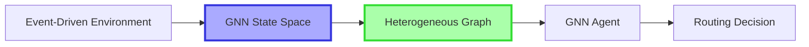

---

## Graph Structure

### Node Types (3 Types)

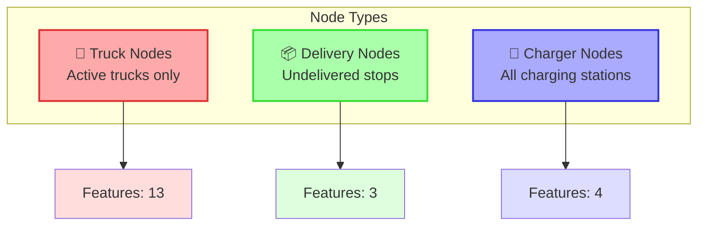

**Key Properties:**
- ✅ No padding - each node type has different feature dimensions
- ✅ Dynamic - only active/undelivered nodes included
- ✅ No depot nodes - simplified representation
- ❌ Completed/failed trucks excluded
- ❌ Already delivered nodes excluded

---

## Node Features

### 🚛 Truck Node Features (13 features)

| Feature | Description | Normalization |
|---------|-------------|---------------|
| `node_type` | Node type identifier | `÷ 3` (0.0 for truck) |
| `current_position` | Current node ID | `÷ num_nodes` |
| `battery_level` | Current battery (kWh) | `÷ capacity` |
| `battery_percentage` | Battery % | `÷ 100` |
| `is_ready` | State: ready for action | Binary (0/1) |
| `is_routing` | State: traveling | Binary (0/1) |
| `is_waiting_to_charge` | State: in queue | Binary (0/1) |
| `is_charging` | State: charging | Binary (0/1) |
| `deliveries_done` | Completed deliveries | `÷ total_deliveries` |
| `deliveries_remaining` | Remaining deliveries | `÷ total_deliveries` |
| `time_elapsed` | Total time spent | `÷ max_time` |
| `distance_traveled` | Total distance (km) | `÷ 1000` |
| `time_to_destination` | ETA if routing | `÷ max_time` |

### 📦 Delivery Node Features (3 features)

| Feature | Description | Normalization |
|---------|-------------|---------------|
| `node_type` | Node type identifier | `÷ 3` (0.33 for delivery) |
| `node_id` | Delivery node ID | `÷ num_nodes` |
| `sequence_index` | Position in route | `÷ max_stops` |

### 🔌 Charger Node Features (4 features)

| Feature | Description | Normalization |
|---------|-------------|---------------|
| `node_type` | Node type identifier | `÷ 3` (0.67 for charger) |
| `node_id` | Charger node ID | `÷ num_charging_nodes` |
| `occupancy_rate` | Current/capacity | `0.0 - 1.0` |
| `queue_length` | Waiting trucks | `÷ num_trucks` |

---

## Edge Types & Connectivity

### Edge Structure (9 Edge Types)

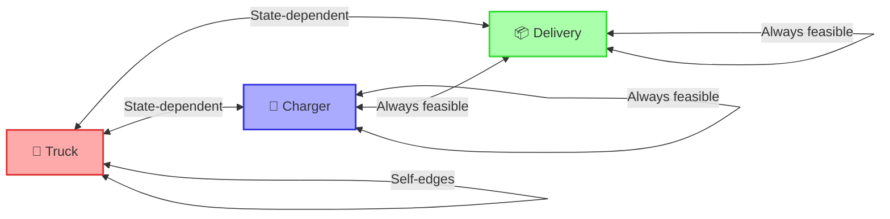

**Edge Types:**
1. `(truck, to, delivery)` - Truck to delivery navigation
2. `(delivery, to, truck)` - Bidirectional
3. `(truck, to, charger)` - Truck to charger navigation
4. `(charger, to, truck)` - Bidirectional
5. `(truck, to, truck)` - Inter-truck relationships
6. `(charger, to, charger)` - Charger network
7. `(charger, to, delivery)` - Infrastructure-delivery links
8. `(delivery, to, charger)` - Bidirectional
9. `(delivery, to, delivery)` - Delivery sequence relationships

### Edge Features (2 features per edge)

| Feature | Description | Normalization |
|---------|-------------|---------------|
| `energy_distance` | Energy required (kWh) | `÷ 1000` |
| `time_distance` | Travel time (hours) | `÷ max_time` |

**Special Case:** When truck is routing, edge to destination has:
- `energy_distance = 0.0` (already committed)
- `time_distance = remaining_time / max_time`

---

## State-Dependent Edge Construction

### When Truck is READY

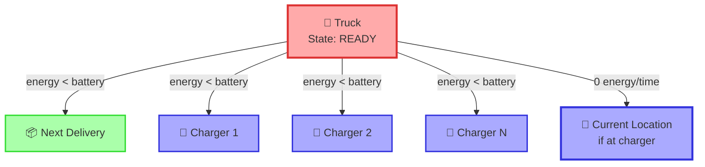

**Rules:**
- ✅ Connect to **next delivery** (if energy feasible)
- ✅ Connect to **all chargers** (if energy feasible)
- ✅ Include self-loop if at charger (0 cost)

### When Truck is ROUTING

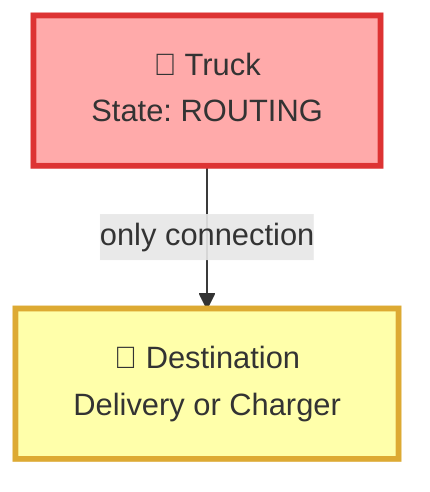

**Rules:**
- ✅ Connect **only to destination** node
- ✅ Edge weight = remaining time (energy = 0)

### When Truck is CHARGING/WAITING

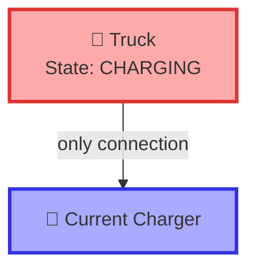

**Rules:**
- ✅ Connect **only to current charger**
- ✅ Edge weight = 0 (at location)

---

## Feasible Actions Architecture

### Action Space Structure

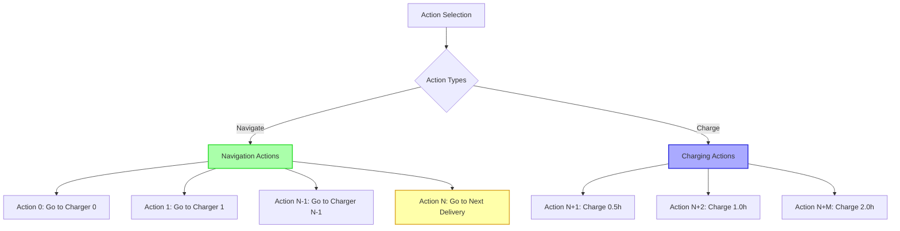

**Action Ordering:**
1. **Actions 0 to N-1:** Navigate to chargers (sorted by charger ID)
2. **Action N:** Navigate to next delivery
3. **Actions N+1 to N+M:** Charge at current location (by duration)

### Feasibility Mask Generation

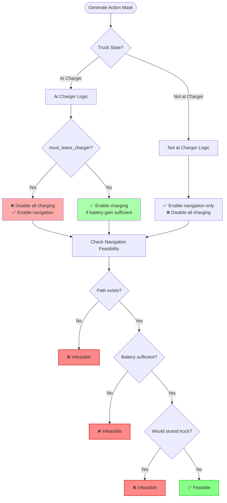

### Action Graph Features (3 features per action)

For each **feasible** action, we compute:

| Feature | Description | Values |
|---------|-------------|--------|
| `action_type` | Type of action | `1/3` = delivery, `2/3` = charger, `3/3` = charge |
| `resulting_soc` | Battery after action | `0.0 - 1.0` |
| `charge_duration` | Charging time (if charging) | `÷ max_charge_duration` |

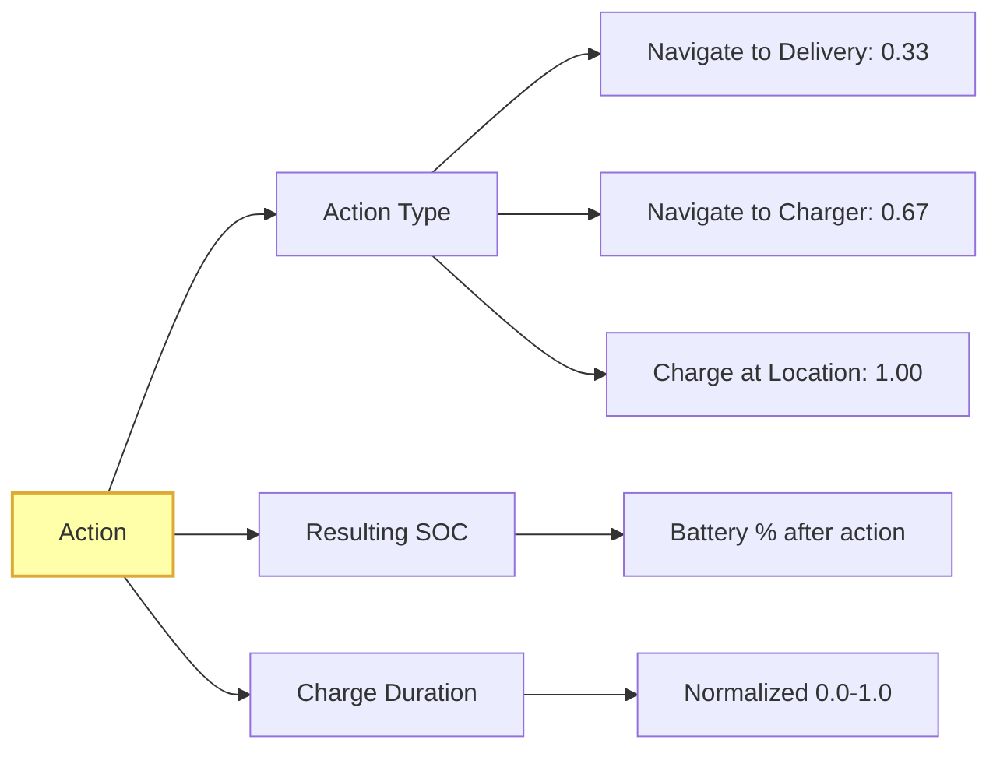

---

## Action-to-Node Mapping

The GNN agent selects actions by attending to node embeddings:

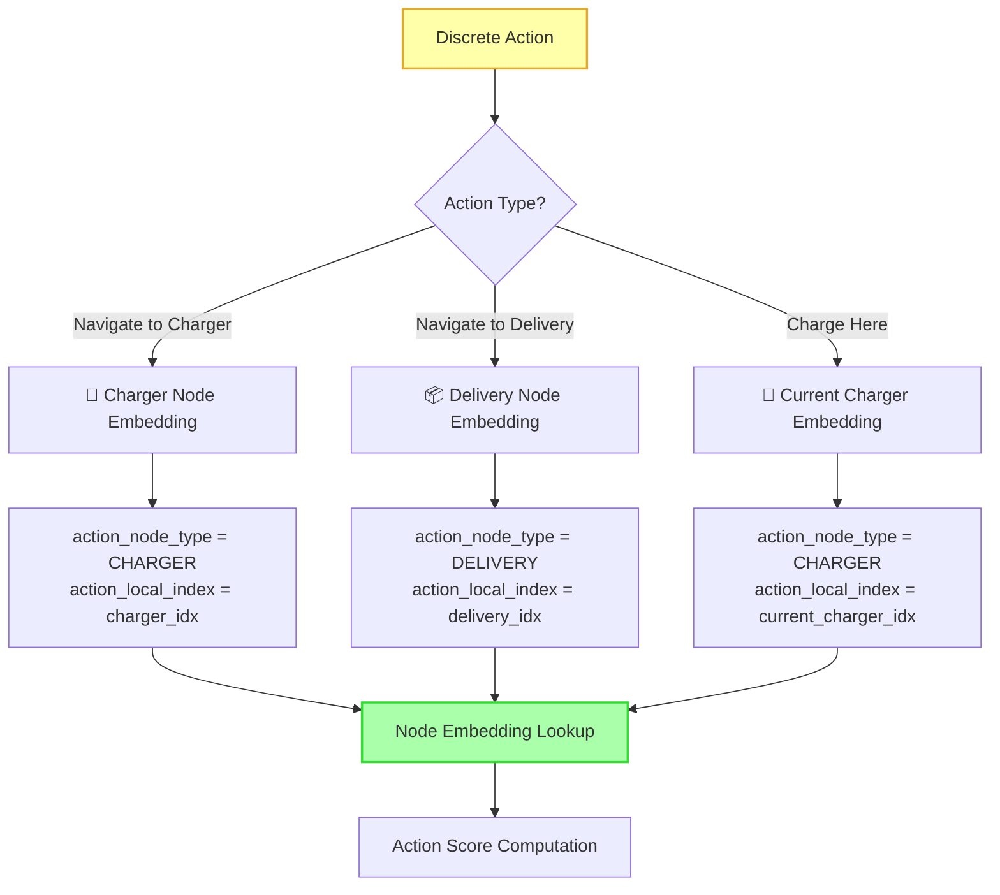

**Metadata Tensors:**
- `action_node_type`: Maps action → node type (truck/delivery/charger)
- `action_local_index`: Maps action → index within node type tensor
- `action_is_charging`: Boolean flag for charging actions
- `action_charge_durations`: Charge time for each action
- `feasible_action_mask`: Boolean mask of valid actions

---

## Complete State Graph Example

### Scenario: 1 Truck, 2 Deliveries, 2 Chargers

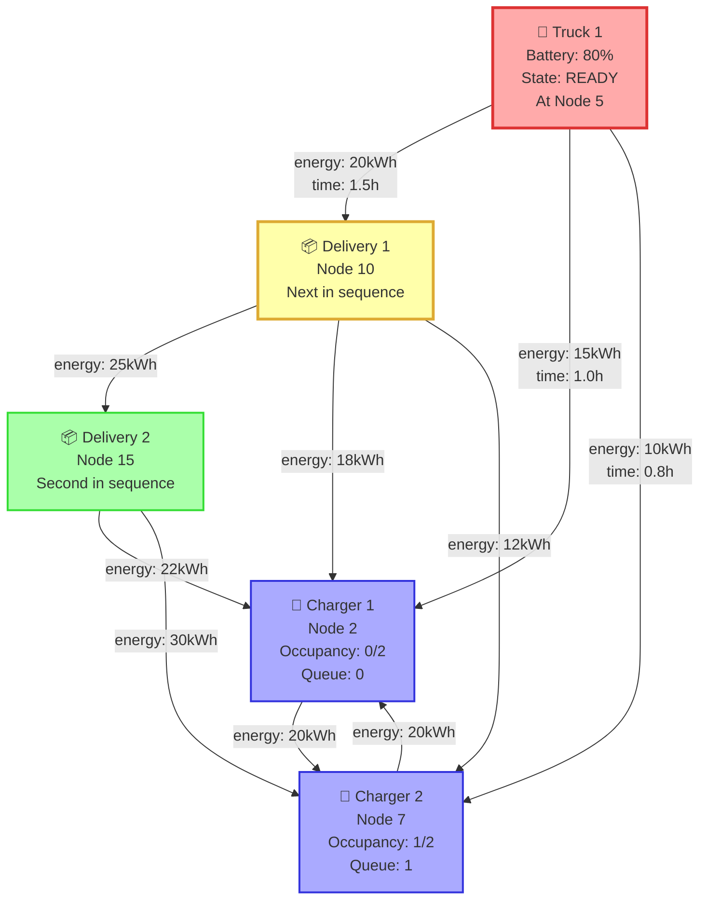

**Feasible Actions:**
- ✅ **Action 0:** Navigate to Charger 1 (energy feasible)
- ✅ **Action 1:** Navigate to Charger 2 (energy feasible)
- ✅ **Action 2:** Navigate to Delivery 1 (energy feasible + won't strand)
- ❌ **Action 3-5:** Charge here (not at charger)

---

## Data Flow Pipeline

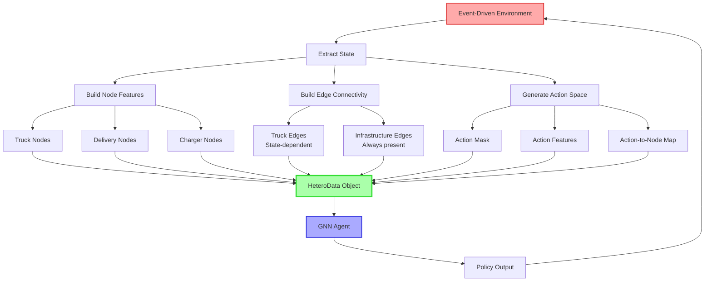

---

## Key Advantages

### 1. Dynamic Graph Structure
- Automatically excludes completed/failed trucks
- Removes delivered nodes
- Adapts to current problem state

### 2. State-Aware Connectivity
- Truck edges reflect current state (ready/routing/charging)
- Prevents invalid actions at graph level
- Encodes temporal constraints

### 3. Heterogeneous Design
- Different node types capture different semantics
- Flexible feature dimensions per type
- Enables specialized message passing

### 4. Action Grounding
- Direct mapping from actions to node embeddings
- GNN can attend to action targets
- Feasibility encoded in both graph structure and mask

### 5. Scalability
- No padding → efficient memory usage
- Sparse connectivity → O(E) message passing
- Batch processing support

---

## Implementation Notes

### Normalization Strategy
- **Spatial features:** Divided by graph size
- **Battery features:** Divided by capacity (0-1 range)
- **Time features:** Divided by max simulation time
- **Distance features:** Divided by 1000 (km → normalized)

### Edge Feasibility Criteria
```python
# Edge is added if:
energy_required < truck_battery  # For truck edges
energy_required < max_battery_capacity  # For infrastructure edges
energy_required != infinity  # Path exists
```

### Action Feasibility Criteria
```python
# Navigation action is feasible if:
1. Path exists (energy != infinity)
2. Battery sufficient (energy < current_battery)
3. Won't strand truck (post-delivery check)
4. Truck not required to charge now

# Charging action is feasible if:
1. At charger location
2. Not forced to leave (must_leave_charger == False)
3. Charge provides enough energy to reach next destination
```

---

## Summary

The GNN State Space provides a **rich, dynamic, heterogeneous graph representation** that:

✅ Captures spatial relationships between trucks, deliveries, and chargers  
✅ Encodes truck states and temporal constraints  
✅ Provides feasible action space with direct node grounding  
✅ Scales efficiently with problem size  
✅ Enables end-to-end learning of routing policies  

**Result:** GNN agents can learn to reason about multi-step planning, battery constraints, and charging infrastructure to solve the EV routing problem.
