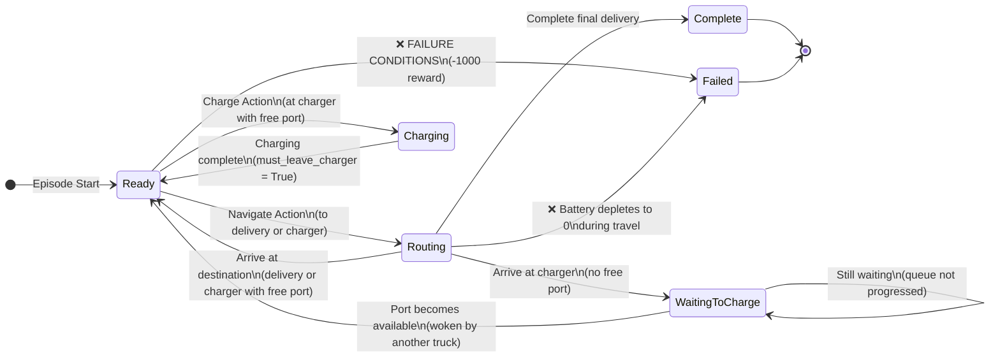

# Truck State Machine and Routing Failure Analysis

## Overview
This document describes the state machine for electric trucks in the Event-Driven Truck Routing Environment and identifies all scenarios where routing can fail, resulting in a **-1000 penalty reward**.

---

## State Machine Definition

The truck environment uses an event-driven architecture with a global clock. Each truck can be in one of the following states:

### States

1. **`ready`** - Truck is at a node and ready to make a decision
2. **`routing`** - Truck is traveling to a destination (delivery or charger)
3. **`waiting_to_charge`** - Truck is at a charger but no charging port is available
4. **`charging`** - Truck is actively charging at a charging station
5. **`complete`** - All deliveries have been successfully completed
6. **`failed`** - Truck has failed due to battery exhaustion or infeasible routing

---

## State Transition Diagram



---

## Failure Conditions: When Does Routing Fail with -1000 Reward?

The environment applies a **failure penalty of -1000** in the following scenarios:

### 1. **No Valid Path Exists** (`energy == inf`)
**Location**: `_execute_navigation_action()` and `_execute_navigation_action_gnn()`

```python
energy_used = self.transport_graph.get_path_energy(current_node, target_node)

if energy_used == float("inf"):
    truck.failed = True
    self.truck_states[truck.truck_id] = "failed"
    return self.reward_config["failure_penalty"]  # -1000
```

**When it happens**:
- Target node is unreachable from current node in the transportation graph
- No physical path exists between nodes
- Graph connectivity issue

---

### 2. **Insufficient Battery for Navigation** 
**Location**: `_execute_navigation_action()` and `_execute_navigation_action_gnn()`

```python
discharge = energy_used

if discharge > truck.current_battery:
    truck.failed = True
    self.truck_states[truck.truck_id] = "failed"
    return self.reward_config["failure_penalty"]  # -1000
```

**When it happens**:
- Truck attempts to navigate to a node but doesn't have enough battery
- Battery required for trip > current battery level
- Example: Need 150 kWh, but only have 100 kWh

---

### 3. **Infeasible Navigation to Non-Terminal Delivery**
**Location**: `_execute_navigation_action()` and `_execute_navigation_action_gnn()`

This check prevents trucks from getting stranded at intermediate delivery points.

```python
if is_delivery_nav:
    is_feasible = check_navigation_feasibility(
        truck=truck,
        target_node=target_node,
        discharge=discharge,
        transport_graph=self.transport_graph,
        charging_nodes=self.charging_nodes,
        verbose=self.verbose
    )
    
    if not is_feasible:
        truck.failed = True
        self.truck_states[truck.truck_id] = "failed"
        return self.reward_config["failure_penalty"]  # -1000
```

**When it happens** (checked in `check_navigation_feasibility()`):

The function performs three checks to ensure truck has at least one feasible action after arriving at the delivery:

#### Check 1: Can reach any charger?
```python
battery_after_arrival = truck.current_battery - discharge

for charger_node in charging_nodes:
    energy_to_charger = transport_graph.get_path_energy(target_node, charger_node)
    if energy_to_charger <= battery_after_arrival:
        return True  # Feasible!
```

#### Check 2: Can complete all remaining deliveries?
```python
temp_battery = battery_after_arrival
temp_node = target_node
for delivery_node in remaining_after_target:
    energy_needed = transport_graph.get_path_energy(temp_node, delivery_node)
    if energy_needed > temp_battery:
        break  # Cannot complete
    temp_battery -= energy_needed
    temp_node = delivery_node
else:
    return True  # Can complete all!
```

#### Check 3: Can reach next delivery and then a charger?
```python
next_delivery = remaining_after_target[0]
energy_to_next = transport_graph.get_path_energy(target_node, next_delivery)

if energy_to_next <= battery_after_arrival:
    battery_after_next = battery_after_arrival - energy_to_next
    for charger_node in charging_nodes:
        energy_to_charger = transport_graph.get_path_energy(next_delivery, charger_node)
        if energy_to_charger <= battery_after_next:
            return True  # Feasible path exists!
```

If **all three checks fail**, the navigation is considered infeasible and receives the -1000 penalty.

---

### 4. **Battery Depletes to Zero During Travel**
**Location**: `truck.move_to_node()` in `Truck` class

```python
def move_to_node(self, node: int, distance: float, travel_time: float, discharge: float):
    self.current_node = node
    self.current_battery -= discharge
    
    # Check if out of battery
    if self.current_battery <= 0:
        self.current_battery = 0
        self.failed = True  # Truck fails
```

**When it happens**:
- Battery reaches exactly 0 or negative after a move
- This is typically caught earlier by Check #2, but serves as a safety check
- Could occur due to rounding errors or edge cases

---

## Summary of Failure Scenarios

| # | Failure Condition | Check Location | Trigger |
|---|-------------------|----------------|---------|
| 1 | No valid path exists | Navigation action | `energy == inf` |
| 2 | Insufficient battery for trip | Navigation action | `discharge > current_battery` |
| 3 | Infeasible intermediate delivery | Navigation action | All 3 feasibility checks fail |
| 4 | Battery depletes to zero | After move | `current_battery <= 0` |

---

## Reward Structure

```yaml
# From config.yaml
rewards:
  time_multiplier: 1.0         # Penalty per hour: -1.0 per hour
  delivery_bonus: 100.0        # Bonus for completing a delivery
  failure_penalty: -1000.0     # ❌ FAILURE PENALTY
```

**Total reward for a failed action**:
```
reward = failure_penalty = -1000.0
```

Plus any accumulated waiting penalties from the buffer.

---

## Event Types

The environment uses two main event types:

1. **`TRUCK_READY`** - Truck needs to make a decision
   - Triggered after: arrival at node, charging complete, port becomes available
   
2. **`TRUCK_ROUTING`** - Truck arrival at destination
   - Triggered when: routing action completes

---

## Key State Flags

### In `Truck` class:
- `is_complete` - True when all deliveries done
- `failed` - True when truck fails (battery or infeasible routing)
- `is_charging` - True while actively charging
- `must_leave_charger` - True after charging complete (forces navigation action)
- `route_destination` - Next destination node (for GNN state)
- `route_arrival_time` - When truck will arrive (for GNN state)

### In Environment:
- `truck_states` - Dictionary mapping truck_id to state string
- `active_truck_id` - Which truck is currently making decisions
- `waiting_start_times` - Tracks when trucks started waiting at chargers

---

## Prevention Strategies

To avoid the -1000 failure penalty:

### For RL Agents:
1. **Always check battery before navigation** - Ensure `current_battery >= energy_required`
2. **Use action masking** - Mask infeasible actions (provided by environment)
3. **Charge proactively** - Don't wait until battery is critically low
4. **Consider future deliveries** - Ensure path to charger exists from intermediate deliveries

### For Heuristic Policies:
1. **Greedy charging threshold** - Charge when battery < threshold (e.g., 50%)
2. **Nearest charger strategy** - Always go to nearest reachable charger
3. **Lookahead planning** - Check if delivery → charger → next delivery is feasible

---

## Traffic Simulation Impact

When traffic is enabled, actual travel times can vary from base times:
```python
actual_travel_time = normal(loc=base_time, scale=std_dev)
# Clamped to [0.01 * base_time, 2.0 * base_time]
```

**Note**: Traffic affects **time** but not **energy consumption**. Failure conditions based on energy remain deterministic.

---

## Charging Station Gating

Trucks can enter `waiting_to_charge` state if:
- Arrive at charger with no free ports
- Another truck is using all available ports

**Recovery**:
- Truck waits in queue
- Gets woken (TRUCK_READY event) when another truck leaves
- Incurs waiting time penalty: `-waiting_hours * time_multiplier`

This is **NOT** a failure condition - trucks eventually get to charge.

---

## Configuration

Default failure penalty:
```yaml
# config.yaml
rewards:
  failure_penalty: -1000.0
```

Can be modified by changing the config file before environment initialization.
