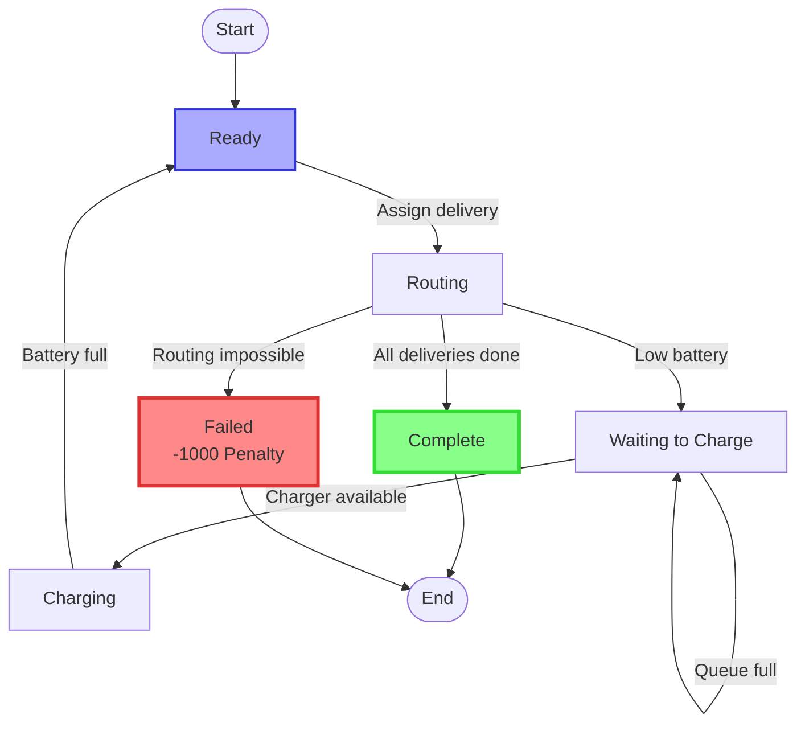
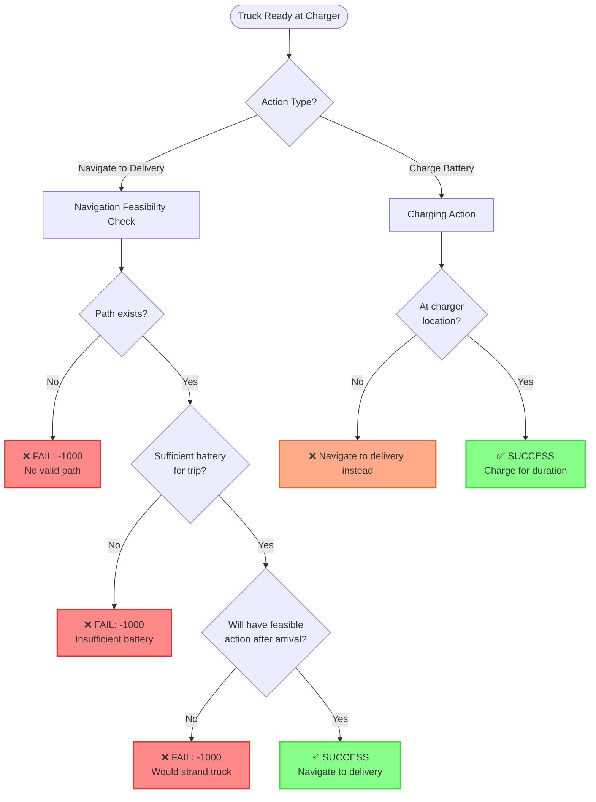
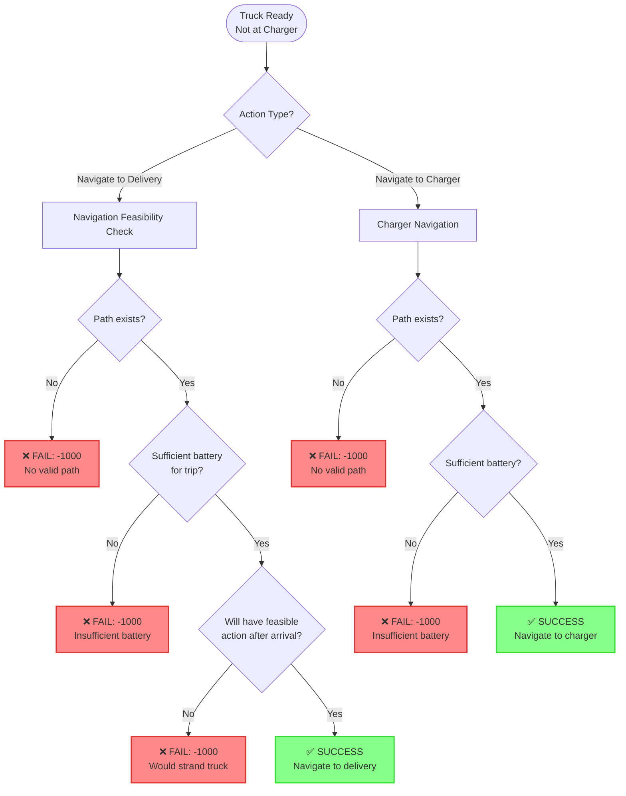

# Truck State Machine - Simplified

## State Diagram

## States

| State | Description |
|-------|-------------|
| **Ready** | Truck is idle, ready for assignment |
| **Routing** | Traveling to delivery or charger |
| **Waiting to Charge** | In queue for charger |
| **Charging** | Actively charging battery |
| **Complete** | All deliveries finished |
| **Failed** | Routing impossible (-1000 penalty) |

## Failure Conditions (-1000 Reward)

The truck enters the **Failed** state when routing is impossible:

1. **No Valid Path** - Target is unreachable
2. **Insufficient Battery** - Not enough charge for the trip
3. **Would Strand Truck** - Delivery would leave truck unable to reach charger or complete mission

## Key Transitions

- **Ready → Routing**: Dispatcher assigns next delivery
- **Routing → Failed**: Path validation fails
- **Routing → WaitingToCharge**: Battery below threshold, needs charging
- **Routing → Complete**: Last delivery finished
- **WaitingToCharge → Charging**: Spot opens in charging queue
- **Charging → Ready**: Battery recharged to capacity

---

## Action Feasibility Graphs

### 1. When Truck is Ready (at Charger)

**Feasibility Checks for Navigation (3-step algorithm):**

1. **Can reach any charger** from target delivery?
   - If YES → Action is feasible
   
2. **Can complete all remaining deliveries** from target without charging?
   - If YES → Action is feasible
   
3. **Can reach next delivery then a charger** from target?
   - If YES → Action is feasible
   - If NO to all 3 → **FAIL: -1000 penalty**

### 2. When Truck is Ready (not at Charger)

**Key Differences:**
- When not at a charger, the truck can navigate to either:
  - Next delivery (with full feasibility check)
  - A charging station (basic path + battery check)
- Charging action is not available when not at a charger location

---

## Detailed Failure Conditions

| Check | Condition | Penalty |
|-------|-----------|---------|
| **Path Validity** | `energy == infinity` | -1000 |
| **Battery Sufficiency** | `discharge > current_battery` | -1000 |
| **Post-Delivery Feasibility** | Cannot reach charger, complete remaining deliveries, OR reach next delivery + charger | -1000 |
| **Battery Depletion** | `battery <= 0` during travel (safety catch) | -1000 |
